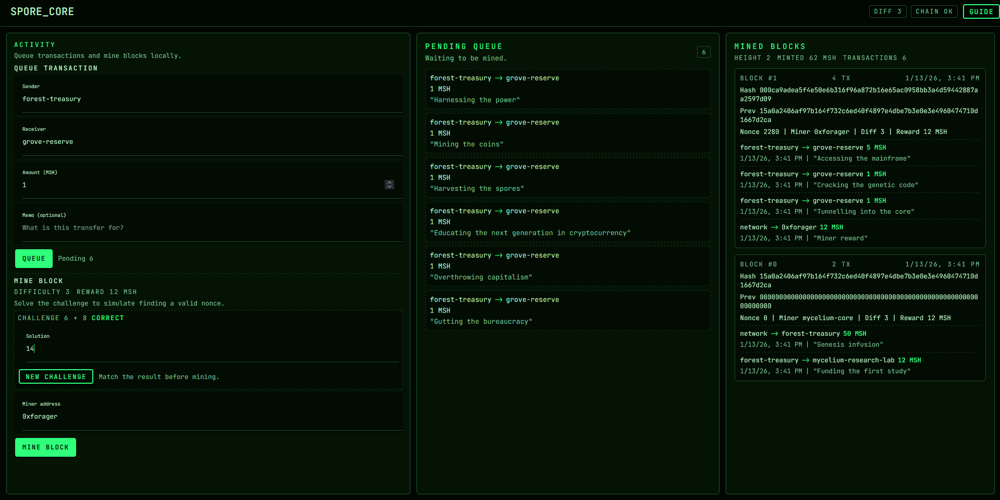

# spore_core

spore_core is a decentralised cryptocurrency implementation built for educational purposes. it runs entirely in the browser and demonstrates mining, transactions, and block validation with a simple proof of work chain. it is not intended for production use or real funds.



## features
- proof of work mining with miner rewards
- pending transaction queue and block creation
- block explorer view of hashes, nonces, and transactions
- ionic ui built on angular standalone components

## run and build
install and run:
```bash
npm install
npm start
```

build:
```bash
npm run build
```
